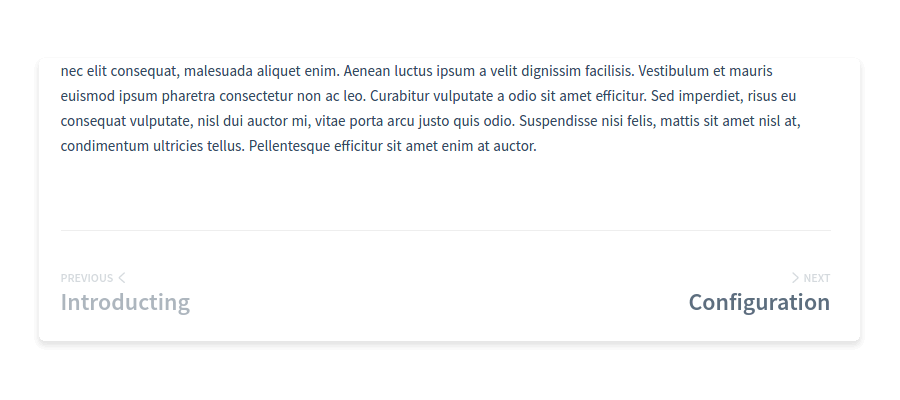

# docsify-pagination
> Pagination for docsify

[](https://www.npmjs.com/package/docsify-pagination)
[](./LICENSE)
[](http://makeapullrequest.com)

## How does it look like?


## Install
1. insert script into document

  ```html
  <script src="//unpkg.com/docsify-pagination/dist/docsify-pagination.min.js"></script>
  ```

2. specify the label text (optional)

  ```javascript
  window.$docsify = {
    // ...
    pagination: {
      previousText: '上一章节',
      nextText: '下一章节',
    },
  }
  ```

## Options
### pagination.previousText
* **Default:** ``'PREVIOUS'``
* **Type:** ``String``
* **Description:** The text of previous label.

### pagination.nextText
* **Default:** ``'NEXT'``
* **Type:** ``String``
* **Description:** The text of next label.

## Example
- [example/index.html](example/index.html)
- [Tina.js](https://tina.js.org/)

## Related
- [docsify](https://github.com/QingWei-Li/docsify/)

## License
MIT &copy; [yelo](https://github.com/imyelo)
